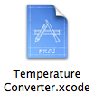
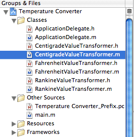

================
UnitKit Tutorial
================

This quick tutorial will show you how to get started with UnitKit. It uses a project that is already on your system, the venerable Temperature Converter project, to show you the steps that are required to add unit tests to your codebase.

Prerequisites
-------------

Before going through this tutorial, make sure that you've got 

- The latest version of UnitKit installed on your system. See the `installation`_ page if you need to install UnitKit. 
- The latest version of Xcode Tools. On Panther, this is Xcode 1.5. 

.. _installation: installation.html

This tutorial should work just fine with other versions of Xcode and UnitKit, but your mileage may vary.

The Temperature Converter Project
-----------------------------------------

The Temperature Converter project is located in the ``/Developer/Examples/AppKit`` folder. As a convenience, you can easily locate in the Finder by clicking on the file icon to the right. Double-click on the project file in Finder to open the project in Xcode. Once opened, build and run the project to get a feeling for how the application works.

The primary logic of the Temperature Converter application is composed of three ``NSValueTransformer`` subclasses that are wired to the user interface using Cocoa Bindings along with a bit of glue logic in the ``ApplicationDelegate`` class. The value transformers convert Centigrate, Fahrenheit, and Rankine temperatures to Kelvin.

The value transformers are found in the following three classes:

- ``CentigradeValueTransformer``
- ``FahrenheitValueTransformer``
- ``RankineValueTransfomer``

Each of these classes implmenets two transformation methods defined by the ``NSValueTransformer`` class: ``transformedValue:`` and ``reverseTransformedValue:``. To fully test the logic of the application, we  need to provide tests which will exercise these transformer methods on each of the transformer classes and make sure that for a range of given inputs, we get the correct outputs.

Add a Test Bundle Target
--------------------------

The first step to adding the value transformer tests is to add a *UnitKit Test Bundle* target to the project. This will give you the ability to compile your tests seperate from your application and create a dependancy in Xcode so that compilation of the Temperature Converter application will require that all tests pass. To add the target, use the **Project > New Target** menu and then select  **UnitKit Bundle** in the New Target Assistant.

.. image:: images/newTargetAssistant.gif
   :class: croppedscreenshot

The next dialog that will appear will let you name the target. Name it *TemperatureConverterTests* and hit the Finish button.

Add the UnitKit Framework. This step is necessary so that the tests can link against the framework and everything can work well. (If I could I'd get rid of this bugaboo). 

Project > Add To Project, Navigate to /Library/Frameworks/UnitKit.framework and hit the add button.

.. image:: images/ukFrameworkLocation.gif
   :class: croppedscreenshot

Add the UnitKit Framework to the Project
----------------------------------------

Add Test Classes to the Test Bundle
-----------------------------------

Build the Test Target to Test
-----------------------------
