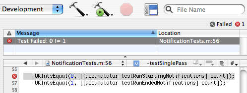

=======
UnitKit
=======
-----------------
Get Your Test On!
-----------------

UnitKit is a `unit testing framework`_ for Objective-C code that features tight Xcode integration and focuses on letting you get your job done. It rethinks the unit test in light of the highly dynamic nature of Objective-C and the Xcode IDE user interface. Tests are quick to write, easy to run, and give feedback directly into Xcode.

.. _unit testing framework: http://en.wikipedia.org/wiki/Unit_testing

But, we aren't content to stop there. Now that the foundation has been laid with the first versions of UnitKit, we're shifting gears and finding as many ways as possible to make testing easier, better, and more fun. For example, the new Growl_ integration in the upcoming UnitKit 2 will allow you to see test results in a way that reinforces and rewards your commitment to testing.

.. _Growl: http://www.growl.info/

How UnitKit Works
------------------

UnitKit tests are simple assertions that are compiled into test classes. When these tests are run, the result is a pass or a fail condition. UnitKit communicates these conditions to Xcode in such a way that you can see the failures. A simple click of any test failure will take you right to the offending line of code allowing you to see exactly what the problem is.

As you can see, instead of running a separate tool outside of the Xcode UI and having to potentially wade through lots of output, UnitKit's integration with Xcode means that you can focus on one thing: Making better code.

You Have Many Options
---------------------

UnitKit isn't the only testing framework available for Objective-C code, but it might just be one of the best. Give it a try. It's free to download and free to use. No restrictions and no hidden agendas. If it helps you do your job better, then everyone wins. And, if UnitKit isn't your cup of tea, you haven't lost anything and you can always try one of the other excellent unit test frameworks available, such as OCUnit_, ObjCUnit_, or TestKit_.

.. _OCUnit: http://www.sente.ch/software/ocunit/
.. _ObjCUnit: http://oops.se/objcunit/
.. _TestKit: http://testkit.sourceforge.net/

Why are we telling you about the other unit test frameworks instead of telling you only about the virtues of UnitKit? It comes down to this: If you don't test with UnitKit, please at least test. Unit testing is probably the single most effective thing that you can do to improve the quality of your code. UnitKit is a good tool, and it meets our needs, but you might prefer using a different tool. One that might more closely meets your needs.

That said, we like UnitKit a lot and hope that you do too.

Stable Released Version
=======================

The current stable distribution is version 1.1 released October 2004. This is the version that all UnitKit users should be using.

- `UnitKit 1.1 DMG`_ (Compressed Disk Image)
- `UnitKit 1.1 Documentation PDF`_

.. _UnitKit 1.1 DMG: 1.1/UnitKit-1.1.dmg
.. _UnitKit 1.1 Documentation PDF: 1.1/UnitKit-1.1-Manual.pdf

Development Version
===================

Development on UnitKit 2 is ongoing. If you would like to check it out, you can download the distribution. UnitKit 2 is definitly still beta material, so please treat accordingly.

- `UnitKit 2.0 DMG`_ (Compressed Disk Image)

.. _UnitKit 2.0 DMG: 2.0/UnitKit-2.0.dmg

It is also available via a Subversion repository_. If you have Subversion installed, you can check it out using the following command:

.. _repository: https://svn.x180.net/public/unitkit/trunk

::

$ svn co https://svn.x180.net/public/unitkit/trunk UnitKit

The `UnitKit 2 documentation`_ is currently being built in HTML form on this site. Improvements will happen as they happen. Those things are coming, but they aren't there yet. You can browse the documentation here.

.. _UnitKit 2 documentation: 2.0/docs/index.html

License
=======

UnitKit is provided under the terms of the `Apache 2.0 License`_. The license gives you the right to use, modify, and redistribute UnitKit without charge. You should read the license to understand exactly what you are getting into, but trust us, it's painless.

.. _Apache 2.0 License: http://www.apache.org/licenses/LICENSE-2.0

Discussion
==========

To keep up with the latest in UnitKit news and to keep up with how other people are using UnitKit, you can use the `UnitKit mailing list`_.

.. _UnitKit mailing list: http://seven.pairlist.net/mailman/listinfo/unitkit
